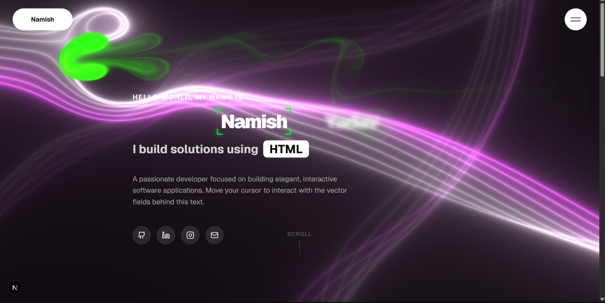

# 🚀 Modern Developer Portfolio

A modern, animated, and fully responsive developer portfolio built with **Next.js**, **TypeScript**, **Tailwind CSS**, and **GSAP**.

Designed to help developers showcase their projects, skills, and experience with a polished UI, smooth animations, and excellent performance.

## 🌐 Live Demo

🔗 https://namish-yadav.github.io/portfolio/

## 📸 Preview



## ✨ Features

* Modern and responsive design
* Smooth GSAP animations
* Interactive UI components
* Mobile-first experience
* Dark theme interface
* Optimized performance
* Reusable component architecture
* Easy customization
* SEO-friendly structure
* Built with modern web technologies

## 🛠️ Tech Stack

* Next.js
* TypeScript
* React
* Tailwind CSS
* GSAP
* Lucide React

## 🚀 Getting Started

Clone the repository:

```bash
git clone https://github.com/namish-yadav/portfolio.git
```

Navigate to the project:

```bash
cd portfolio-website-build
```

Install dependencies:

```bash
npm install
```

Start the development server:

```bash
npm run dev
```

Open:

```bash
http://localhost:3000
```

## 📂 Project Structure

```text
app/
components/
hooks/
public/
styles/
```

## 🎨 Customization

You can easily customize:

* Personal information
* Projects
* Skills
* Social links
* Resume
* Contact details
* Colors and animations

## 🤝 Contributing

Contributions, issues, and feature requests are welcome.

Feel free to fork the repository and submit a pull request.

## ⭐ Show Your Support

If you found this project useful:

* Star the repository
* Fork the project
* Share it with others

## 📄 License

This project is licensed under the MIT License.

---

Built with ❤️ by Namish Yadav

### Connect With Me

* GitHub: https://github.com/namish-yadav
* Portfolio: https://namish-yadav.github.io/first-portfolio/
